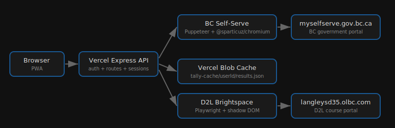

<div align="center">

# Tally


Check your cheques without the bureaucracy.

[tally.heyitsmejosh.com](https://tally.heyitsmejosh.com)

</div>

## Architecture



## Stack

- Express + Puppeteer (`@sparticuz/chromium` on Vercel)
- Vercel Blob — per-user scrape cache
- Session auth (AES-256-CBC encrypted credentials)
- BC Self-Serve scraper

## Dev

```bash
npm install
npm start
```

Open http://localhost:3000. Copy `.env.example` to `.env`.

## Roadmap

- [x] iOS companion app
- [x] PWA support
- [ ] Auto-fill monthly reports
- [ ] Push notifications for payment dates
- [ ] DTC application automation
- [ ] Offline mode with cached data
- [ ] Multi-province support
