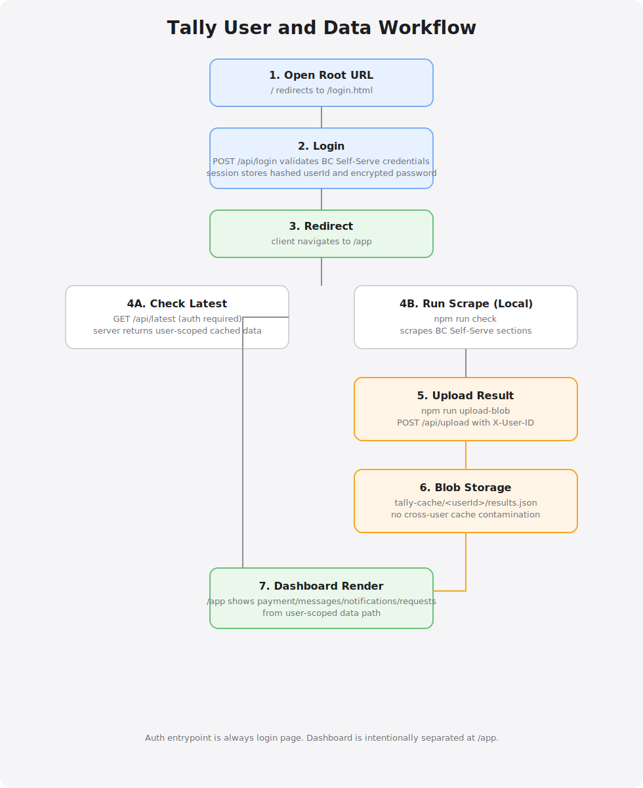

# Chequecheck

*"Check your eligibility."*

Multi-user BC Self-Serve portal scraper with DTC (Disability Tax Credit) eligibility navigator.



## How It Works

**Quick summary:**
1. Login with BC Self-Serve credentials
2. Script validates & encrypts credentials in session
3. Puppeteer scrapes benefits data (30-60s)
4. Upload to Vercel Blob for instant dashboard load
5. View benefits, messages, DTC eligibility calculator

## Features

###  Implemented (v2.0)
- **Multi-user authentication** - Each user logs in with their own BC Self-Serve credentials
- **Secure credential handling** - AES-256-CBC encryption, session-based storage, never logged
- **Rate limiting** - 5 login attempts per 15 minutes
- **Session security** - 2-hour max age, 1-hour activity timeout, httpOnly/secure/SameSite cookies
- **Auto-login fallback** - Uses .env credentials if login fields left blank (admin convenience)
- **Vercel Blob integration** - Dashboard loads instantly from cached data
- **DTC Navigator** - Free eligibility screener for Disability Tax Credit and BC PWD
- **Automated scraping** - Notifications, Messages, Payment Info, Service Requests

###  TODO
- [ ] Deploy to Vercel production
- [ ] Add cron job for automatic scraping
- [ ] Multi-tenant storage (per-user Blob keys)
- [ ] T2201 form pre-filler (DTC application)
- [ ] Email notifications for benefit updates
- [ ] Add session persistence (currently in-memory, won't work multi-instance)

## Quick Start

### Installation
```bash
npm install
```

### Local Development
```bash
# 1. Create .env file (optional - for auto-login)
cp .env.example .env
# Edit .env with your BC Self-Serve credentials

# 2. Start server
npm start

# 3. Visit http://localhost:3000
# Login with BC Self-Serve credentials (or leave blank to use .env)
```

### Running Scraper
```bash
# Scrape BC Self-Serve (saves to data/ folder)
npm run check

# Upload latest results to Vercel Blob
npm run upload-blob
```

## Security

### What Changed (v2.0)
-  Removed `/api/default-credentials` endpoint (was leaking credentials)
-  Added authentication to `/api/latest` endpoint
-  Login validates credentials with actual BC Self-Serve login attempt
-  Credentials encrypted in session (AES-256-CBC)
-  Rate limiting on login attempts
-  .env file excluded from git (.gitignore)

### Important
- ⚠️ **Never commit .env files** - Already in .gitignore
- ⚠️ **Change your BC Self-Serve password** if credentials were previously exposed
- ⚠️ **SESSION_SECRET** should be random in production (auto-generated if not set)

## Deployment (Vercel)

### Prerequisites
- Vercel account with Blob storage enabled
- Local .env file configured for scraping
- GitHub repository connected to Vercel

### Step 1: Set Environment Variables
In Vercel Dashboard → Settings → Environment Variables:
```
UPLOAD_SECRET=<random-string>  # Generate with: openssl rand -hex 32
SESSION_SECRET=<random-string>  # Generate with: openssl rand -hex 32
API_TOKEN=<random-string>       # Optional: for OpenClaw integration
```

### Step 2: Enable Blob Storage
Vercel Dashboard → Storage → Blob → Enable
(Auto-creates `BLOB_READ_WRITE_TOKEN`)

### Step 3: Verify Domain
- Check Settings → Domains
- Should be `chequecheck.vercel.app`
- HTTPS enabled automatically

### Step 4: Deploy
```bash
# Option A: Git push (auto-deploys)
git push origin main

# Option B: CLI
vercel --prod
```

### Step 5: Upload Data
```bash
# Run locally to scrape and upload
npm run check
npm run upload-blob
```

### Step 6: Verify Deployment
```bash
# Test Blob endpoint
curl https://chequecheck.vercel.app/api/latest

# Check summary API (if configured)
curl https://chequecheck.vercel.app/api/summary?token=YOUR_API_TOKEN
```

### Step 7: Access Dashboard
Visit https://chequecheck.vercel.app
- Dashboard loads instantly from Blob cache
- "Check Now" button won't work on Vercel (Puppeteer timeout)
- Must scrape locally and upload

### Troubleshooting

**Problem:** Dashboard shows old data
```bash
npm run check && npm run upload-blob
```

**Problem:** "Unauthorized" on /api/upload
- Check UPLOAD_SECRET in Vercel environment variables

**Problem:** Blob endpoint returns 404
- Settings → Storage → Blob → Ensure enabled
- Redeploy after enabling

## Architecture

### Local Dev
```
User → Login (validates credentials) → Session (encrypted) → Scraper (Puppeteer) → Dashboard
```

### Vercel Production
```
User → Login (validates) → Session → Dashboard (reads from Blob)
                                         ↑
Local Machine → Scraper → Upload Script → Vercel Blob (instant load)
```

## API Endpoints

| Endpoint | Method | Auth | Description |
|----------|--------|------|-------------|
| `/api/login` | POST | No | Validate BC Self-Serve credentials (rate limited) |
| `/api/logout` | POST | No | Destroy session |
| `/api/latest` | GET | Yes | Get cached dashboard data |
| `/api/check` | GET | No | Trigger scrape (uses session/env credentials) |
| `/api/upload` | POST | Token | Upload to Vercel Blob (requires UPLOAD_SECRET) |
| `/api/dtc/screen` | POST | No | DTC eligibility calculator |

## File Structure
```
chequecheck/
├── api/
│   └── upload.js            # Vercel Blob upload endpoint
├── brute/                   # Security testing tools
├── data/                    # Scraped results (local only)
├── docs/                    # Documentation
├── scripts/
│   └── upload-to-blob.js    # Upload latest results to Vercel
├── src/
│   ├── api.js               # Express server, auth, session
│   └── scraper.js           # Puppeteer BC Self-Serve scraper
├── web/
│   ├── login.html           # Login page
│   └── unified.html         # Dashboard UI
├── .env                     # Local credentials (NOT committed)
├── .env.example             # Template
├── CLAUDE.md                # Development guide (this file)
├── package.json
└── README.md
```

## Development Notes

### Testing Login
```bash
# Test invalid credentials
curl -X POST http://localhost:3000/api/login \
  -H "Content-Type: application/json" \
  -d '{"username":"wrong","password":"wrong"}'

# Test .env fallback (leave fields blank)
curl -X POST http://localhost:3000/api/login \
  -H "Content-Type: application/json" \
  -d '{}'
```

### Testing Blob Upload
```bash
# Upload latest results
npm run upload-blob

# Verify on Vercel
curl https://chequecheck.vercel.app/api/latest
```

## License
ISC

## Support
File issues at https://github.com/YOUR_USERNAME/chequecheck/issues
