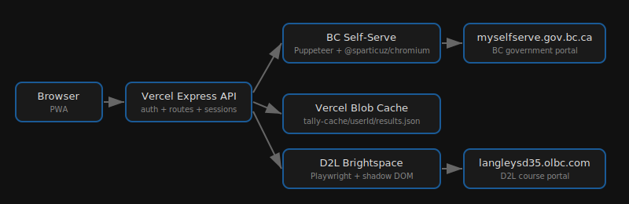

<div align="center">

# Tally


BC benefits tracker + D2L school automation.

[tally.heyitsmejosh.com](https://tally.heyitsmejosh.com)

</div>

## Architecture



## Stack

- Express + Puppeteer (`@sparticuz/chromium` on Vercel)
- Vercel Blob -- per-user scrape cache
- Session auth (AES-256-CBC encrypted credentials)
- BC Self-Serve scraper
- Playwright -- D2L Brightspace scraper (grades, PDF download/submission)

## Features

**Benefits** -- BC Self-Serve scraper, income tracking, payment dates, DTC navigator

**School** -- D2L grade scraper, learning guide PDF auto-fill, automated dropbox submission (iframe dialog + file chooser), grade dashboard (`school.html`)

## Dev

```bash
npm install
npm start
```

Open http://localhost:3000. Copy `.env.example` to `.env`.

## Roadmap

- [x] iOS companion app
- [x] PWA support
- [x] School grade dashboard
- [x] D2L PDF scraper + auto-fill
- [x] D2L dropbox submission (iframe dialog automation)
- [ ] Auto-fill monthly reports
- [ ] Push notifications for payment dates
- [ ] DTC application automation
